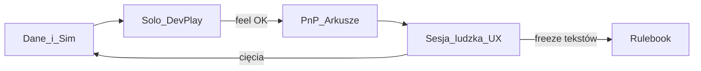

# Roadmap — prototyp intrygi (gra planszowa)

Prototyp w warstwach **A / B / C**. Każda warstwa ma **dwa równoległe tory**:

| Tor | Pytanie |
| :--- | :--- |
| **Dane / silnik** | Czy reguły są spójne i da się je odpalić (docs + karty + sim)? |
| **Stół / wydanie** | Czy da się to **poczuć** (solo), **wydrukować** (PnP), **zmierzzyć przy ludziach** (UX) i **nauczyć** (rulebook)? |

Sim filtruje deadlocki i częstotliwość eventów. **Werdykt fun = sesja ludzka.**

---

## Status warstw danych (zrobione)

| Warstwa | Slice danych | Gate danych |
| :--- | :--- | :--- |
| **A** | Herezja + Inkwizytor + Werdykt + 5 prostych kart/frakcję | Era z Inkwizytorem i głosowaniem |
| **B** | Lochy/Podwójni + Haki + karty narzędziowe | ≥1 Podwójny, ≥1 Hak bez paraliżu AP |
| **C** | 10 kart + Signature + Talia Czasu | Teach 1–2 s.; Signature nie psują A |

Checklisty techniczne A/B/C: zamknięte w repo (GDD, rules, karty, sim smoke).  
**Otwarte:** Solo Dev-Play, PnP, UX stołu, pełny rulebook (poniżej).

---

## Tor 1 — Solo Dev-Play („10 minut na żywym organizmie”)

Cel: designer sprawdza **odczucie** pętli bez drukowania i bez zbierania 4 osób.

### Minimalny produkt solo

- [ ] CLI **narracyjny**: `python -m inquisitio feel --setup 3p-... --seed N`  
  wypisuje Erę jak relację: ruch Inkwizytora → zagrania → Herezja → Werdykt (głosy botów) → Haki/Podwójni  
  Czas celu: **≤10 min** na 1–2 Ery lub skróconą partię.
- [ ] Metryki na końcu: Autodafé, oskarżenia, skazania, Haki, Podwójni, długość, deadlock=0.
- [ ] Opcjonalnie później: prosta **strona Web** (odczyt logu / krok po kroku) — nie blokuje PnP.

### Gate Solo (per warstwa)

| Po | Co musisz „poczuć” solo zanim PnP |
| :--- | :--- |
| **A** | Inkwizytor zagraża lokacjom; Krytyczna → Werdykt nie jest pusty |
| **B** | Hak i Podwójny zmieniają decyzje botów (widać w logu) |
| **C** | Signature pojawiają się rzadko i czytelnie; edykty Czasu zmieniają prawo Ery |

Bez gate Solo **nie** idź w duży druk — najpierw feel CLI.

---

## Tor 2 — PnP (Print & Play)

PnP to **warunek testu ludzkiego**, nie polish końcowy. Final art może czekać; **czytelne arkusze z danych** — nie.

### Pipeline (źródło = Markdown w `game/`)

- [ ] Skrypt generujący z `game/cards/**/*.md` + frakcje + plansza:
  - karty frakcji (1 strona = N kart),
  - Talia Czasu,
  - planszetka gracza (Tor Herezji),
  - plansza 5 lokacji (A3 lub 2×A4),
  - żetony lean: Hak, Podwójny, Stos, Relikwia, Fragment (placeholder ikon).
- [ ] Output: `assets/prototypes/` (PDF lub HTML→PDF). Tekst + proste ikony; **bez** final pixel art.
- [ ] Wariant warstwowy: flaga `--layer A|B|C` (A = tylko 5 kart/frakcję).

### Gate PnP

| Po | Co musi leżeć na stole |
| :--- | :--- |
| **A** | 5 kart×frakcja + Inkwizytor + Herezja + arkusz Werdyktu |
| **B** | + żetony Hak/Podwójny + karty narzędzi B |
| **C** | pełne 10 + Signature + Talia Czasu |

**Zasada:** brak sesji ludzkiej Warstwy X bez PnP dla Warstwy X.

---

## Tor 3 — Human UX (stół)

Sim nie mierzy strachu, zdrady głosu ani AP. To robi **protokół sesji**.

### Metryki obowiązkowe (sesja)

Zapis w [`../playtesting/sessions/_TEMPLATE.md`](../playtesting/sessions/_TEMPLATE.md):

| Metryka | Jak |
| :--- | :--- |
| **Downtime** | min oczekiwania na Fazę III / Werdykt (stoper lub szacunek) |
| **AP / paraliż** | czy limity 1 Hak / Przesłuchanie / Nasłanie wystarczyły? czy ktoś „zamarł”? |
| **Krzyk / emocja Werdyktu** | 1–5: czy głosowanie bolało / było puste? |
| **Czytelność** | teach sheet, ikony PnP, Tor Herezji |
| **Dramat silników** | liczby: Krytyczna, oskarżenia, Autodafé, Hak, Podwójny, Signature |

### Harmonogram stołu vs warstwy

| Sesje | Cel |
| :--- | :--- |
| **≥1× Warstwa A** (3–4p) | Czy Inkwizytor + Werdykt żyją? (bez Haków/Signature w talii PnP A) |
| **≥2× Warstwa B** | Czy Haki/Podwójni dają pazur bez paraliżu? |
| **≥3× Warstwa C** | Pełna asymetria; checkpoint Signature vs czytelność A |

Po każdej sesji: cięcia wracają do `game/cards/` i ewentualnie do sim.

### Gate UX (produktowy)

- Werdykt emocja ≥3/5 w typowej sesji A+.
- Downtime Fazy rozpatrywania / Werdyktu alarm przy **>~15–20 min** ciągnącego się bloku.
- Zero „nie wiem co mogę zagrać” przez >1 minutę u nowicjusza po teachu.

---

## Tor 4 — Rulebook (ścieżka dokumentacji dla graczy)

| Etap | Artefakt | Kiedy |
| :--- | :--- | :--- |
| **0** | Szkic w [`rules/README.md`](rules/README.md) (dla designerów) | już (A–C) |
| **1** | **Teach sheet** 1–2 strony (setup + 5 faz + Werdykt w 5 bulletach) | przed pierwszą sesją PnP A |
| **2** | **Quick reference** (Herezja strefy, limity anti-AP, Inkwizytor) | przed sesjami B |
| **3** | **Pełny rulebook PL** (~12–20 s.): lore krótko, komponenty, setup, fazy, procedury silników, frakcje, FAQ ze stołu | po ≥3 sesjach C + stabilnych tekstach kart |
| **4** | Freeze tekstów → dopiero final art | po rulebooku 3 |

Gate: nowy gracz nauczy się z teach sheet + 1 demo Ery; pełny rulebook rozwiązuje spory, nie zastępuje teachu.

---

## Zintegrowany backlog (kolejność zalecana)

1. [ ] **Solo feel CLI** (`feel` / narracyjny log) — gate Solo A
2. [ ] **PnP generator** z `game/cards` → `assets/prototypes/` — gate PnP A
3. [ ] **Teach sheet** 1–2 s.
4. [ ] Sesja ludzka **A** + UX template
5. [ ] Solo + PnP **B** → sesje B
6. [ ] Solo + PnP **C** → sesje C
7. [ ] Pełny rulebook PL + FAQ
8. [ ] Freeze → final pixel art (`assets/art/`, `assets/icons/`)

Opcjonalnie później: TTS / Web UI do solo (nie blokuje stołu).  
Gra jest zaprojektowana na **3–5 graczy**.

---

## Sim

| Rola | Metryki |
| :--- | :--- |
| Filtr reguł | Deadlocki, legal moves |
| Dramat (częstotliwość) | Autodafé, Haki, Podwójni, oskarżenia |
| Solo Dev-Play | Narracyjny log / `feel` |
| Eksperyment | Próg Herezji 7 vs 8 |

Balans polityczny = **stół**. Kod = nośnik prototypu i filtr crashy.
