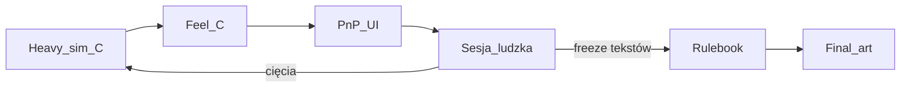

[Strona główna](../README.md) > [Dokumentacja](README.md)

---


# Roadmap — prototyp C

**Produkt na stół = warstwa C** (pełne mechaniki).  
A/B w sim = filtry talii / teach — nie osobne wydania PnP.



## Stan

| Artefakt | Status |
| :--- | :--- |
| Karty + silnik C | gotowe |
| Matryca balansu A/B/C | gate OK (seed 42) |
| Feel C | gotowe |
| PnP UI → `assets/prototypes/` | gotowe |
| Sesja ludzka C | **następne** |
| Rusztowanie zasad (teach / księga / słownik) | gotowe (`docs/rules/`) |
| Rulebook / final art | po ≥1–3 sesjach + freeze tekstów |

## Backlog

1. [x] Heavy sim + feel C + PnP UI
2. [ ] Pierwsza sesja ludzka C + UX ([`../data/playtesting/sessions/_TEMPLATE.md`](../data/playtesting/sessions/_TEMPLATE.md))
3. [ ] Cięcia ze stołu → sim → docs
4. [ ] Rulebook PL + FAQ (na bazie `docs/rules/ksiega.md` + `slownik.md` + sesje)
5. [ ] Freeze → pixel art / 3D

## Gate przed drukiem / stołem

```bash
cd sim && source .venv/bin/activate
python -m inquisitio matrix --games 100 --layers C --seed 42
python -m inquisitio feel --setup 3p-oficjum-alandalus-korona --seed 42 --layer C
```

Deadlocki C niskie; oskarżenia żywe. Notatki: [`../data/playtesting/balance-notes.md`](../data/playtesting/balance-notes.md).

**Werdykt fun = stół.** Sim tylko filtruje patologię.
