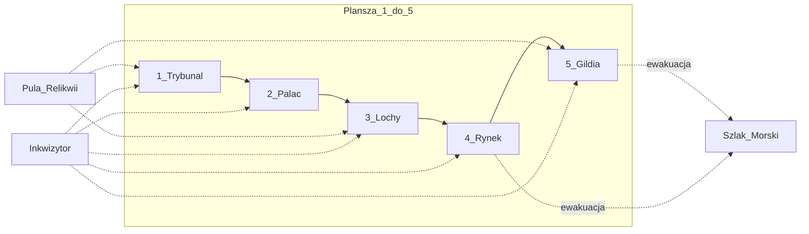

# Plansza — Instytucje Władzy

Mapa instytucjonalna Toledo/Sewilli. Każda lokacja ma **Mechanikę Podwójnego Dna**: stronę Jawną (**Światło**) i Ukrytą (**Cień**).

Akcje Cienia wymagają Agenta w lokacji i zwykle podnoszą Poziom Herezji lub ryzykują odkrycie.  
Figurka **Wielkiego Inkwizytora** stoi w jednej lokacji (Patrol / Autodafé).

| # | Lokacja | Światło (jawne) | Cień (ukryte) |
| :---: | :--- | :--- | :--- |
| 1 | **Trybunał Inkwizycji** | Czystość wiary, poparcie Kościoła | Procesy, konfiskaty, wymuszanie zeznań |
| 2 | **Pałac Gubernatora** | Podatki, dekrety miejskie | Przekupstwo, fałszerstwa akt, zmiana prawa |
| 3 | **Lochy & Podziemia** | Nadzór, publiczne przesłuchania | Areszt, Podwójni, tajne egzekucje |
| 4 | **Rynek i Plac Publiczny** | Handel, najemnicy, nastroje ludu | Zamieszki, herezja publiczna, samosądy |
| 5 | **Dzielnica Smogów / Gildia** | Unikalne dobra, informatorzy | Skrytobójstwa, szantaż, handel Relikwiami |

## Kolejność rozpatrywania (Faza III)

Lokacje odkrywane i rozpatrywane **od 1 do 5**.

## Inkwizytor

- Start: **Trybunał**, stan Patrol.
- Faza I: nasłania → ruch 0–1 wzdłuż łańcucha → opcjonalne Autodafé.
- Autodafé: +1 Herezja właścicielom Agentów w lokacji; +1 Stos; Relikwia → pula.

## Relikwie i szlaki

- Relikwie transportowane między lokacjami (karty / zasady).
- Talia Czasu może otwierać krypty lub **Szlak Morski** (ewakuacja poza planszę).

## Sąsiedztwo (ruch o 1 lokację)

```
Trybunał ↔ Pałac ↔ Lochy ↔ Rynek ↔ Gildia
```

Karty / Signature mogą łamać tę regułę.

---

## Szkic layoutu do wydruku (prototyp papierowy)

Wydrukuj na **A3** (lub 2×A4 sklejone). Pionki Agentów i żetony w polach lokacji; karty Akcji — zakryte w slocie pod lokacją.

```
┌──────────────────────────────────────────────────────────────────────────┐
│                     INQUISITIO 1492 — PLANSZA (szkic)                    │
│  Pula Relikwii [■][■][■][■]     Talia Czasu [■■■]     Stosy [ ][ ]      │
│  Szlak Morski: □/■     Inkwizytor ● (Patrol | Autodafé)                  │
│  Pula Haków [■■■■]     Fragmenty [■■]                                    │
├────────────┬────────────┬────────────┬────────────┬────────────────────┤
│ 1 TRYBUNAŁ │ 2 PAŁAC    │ 3 LOCHY    │ 4 RYNEK    │ 5 GILDIA / SMOGI   │
│            │            │            │            │                    │
│ Agenci:    │ Agenci:    │ Agenci:    │ Agenci:    │ Agenci:            │
│ ○ ○ ○ ○    │ ○ ○ ○ ○    │ ○ ○ ○ ○    │ ○ ○ ○ ○    │ ○ ○ ○ ○            │
│            │            │            │            │                    │
│ Relikwia:  │ Relikwia:  │ Relikwia:  │ Relikwia:  │ Relikwia:          │
│ [ ]        │ [ ]        │ [ ]        │ [ ]        │ [ ]                │
│            │            │ ARESZT:    │            │                    │
│            │            │ □ □ □ □    │            │                    │
│            │            │            │            │                    │
│ Karty      │ Karty      │ Karty      │ Karty      │ Karty              │
│ zakryte:   │ zakryte:   │ zakryte:   │ zakryte:   │ zakryte:           │
│ ▭ ▭ ▭      │ ▭ ▭ ▭      │ ▭ ▭ ▭      │ ▭ ▭ ▭      │ ▭ ▭ ▭              │
│ Światło │  │ Światło │  │ Światło │  │ Światło │  │ Światło │ Cień     │
│ Cień       │ Cień       │ Cień       │ Cień       │                    │
└────────────┴────────────┴────────────┴────────────┴────────────────────┘
         Faza III: odkrywaj i rozpatruj w kolejności 1 → 2 → 3 → 4 → 5
```

### Mermaid (orientacja przestrzenna)



### Legenda slotów

| Element | Co kłaść |
| :--- | :--- |
| Agenci ○ | Pionki frakcji (+ nakładka Podwójny jeśli aktywna) |
| Relikwia [ ] | Żeton Relikwii w lokacji |
| Karty zakryte ▭ | Zagrane w Fazie II, odkrywane w Fazie III |
| Areszt (Lochy) | Agenci uwięzieni przed Przesłuchaniem |
| Inkwizytor ● | Figurka NPC + stan Patrol/Autodafé |
| Szlak Morski | Oznaczany edyktem (np. Flota Kolumba) |
| Haki | Przy planszetkach graczy, nie na lokacjach |

### Playtest

Czy łańcuch jest czytelny? Czy Lochy + Areszt nie giną wizualnie? Czy Inkwizytor na środku (Lochy) jest zbyt dominujący?
