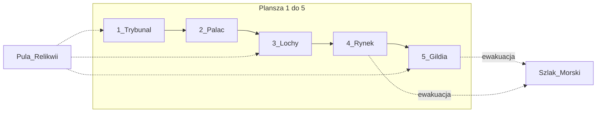

# Plansza — Instytucje Władzy

Mapa instytucjonalna Toledo/Sewilli. Każda lokacja ma **Mechanikę Podwójnego Dna**: stronę Jawną (Światło) i Ukrytą (Cień).

Akcje Cienia wymagają Agenta w lokacji i zwykle podnoszą Poziom Herezji lub ryzykują odkrycie.

| # | Lokacja | Światło (jawne) | Cień (ukryte) |
| :---: | :--- | :--- | :--- |
| 1 | **Trybunał Inkwizycji** | Czystość wiary, poparcie Kościoła | Procesy, konfiskaty, wymuszanie zeznań |
| 2 | **Pałac Gubernatora** | Podatki, dekrety miejskie | Przekupstwo, fałszerstwa akt, zmiana prawa |
| 3 | **Lochy & Podziemia** | Nadzór, publiczne przesłuchania | Ucieczki, tajne egzekucje, wymiana więźniów |
| 4 | **Rynek i Plac Publiczny** | Handel, najemnicy, nastroje ludu | Zamieszki, herezja publiczna, samosądy |
| 5 | **Dzielnica Smogów / Gildia** | Unikalne dobra, informatorzy | Skrytobójstwa, szantaż, handel Relikwiami |

## Kolejność rozpatrywania (Faza III)

Lokacje odkrywane i rozpatrywane **od 1 do 5**.

## Relikwie i szlaki

- Relikwie mogą być transportowane między lokacjami (szczegóły w kartach / zasadach).
- Karty Talii Czasu mogą otwierać nowe krypty lub szlaki morskie (ewakuacja poza planszę).

---

## Szkic layoutu do wydruku (prototyp papierowy)

Wydrukuj na A3 (lub 2× A4 sklejone). Pionki Agentów i żetony kładź w polach lokacji; karty Akcji — zakryte w slocie pod lokacją.

```
┌──────────────────────────────────────────────────────────────────────────┐
│                     INQUISITIO 1492 — PLANSZA (szkic)                    │
│  Pula Relikwii [■][■][■][■]     Talia Czasu [■■■]     Stos Autodafé [ ] │
│  Szlak Morski: □ zamknięty / ■ otwarty  →  EWAKUACJA (poza planszę)     │
├────────────┬────────────┬────────────┬────────────┬────────────────────┤
│ 1 TRYBUNAŁ │ 2 PAŁAC    │ 3 LOCHY    │ 4 RYNEK    │ 5 GILDIA / SMOGI   │
│            │            │            │            │                    │
│ Agenci:    │ Agenci:    │ Agenci:    │ Agenci:    │ Agenci:            │
│ ○ ○ ○ ○    │ ○ ○ ○ ○    │ ○ ○ ○ ○    │ ○ ○ ○ ○    │ ○ ○ ○ ○            │
│            │            │            │            │                    │
│ Relikwia:  │ Relikwia:  │ Relikwia:  │ Relikwia:  │ Relikwia:          │
│ [ ]        │ [ ]        │ [ ]        │ [ ]        │ [ ]                │
│            │            │ ARESZT:    │            │                    │
│ Wpływ /    │ Kontrola:  │ (Agenci    │ Kontrola:  │ Handel Relikwiami  │
│ Kościół:   │ □ □ □      │  uwięzieni)│ □ □ □      │ / szantaż          │
│ □ □ □      │            │ □ □ □ □    │            │                    │
│            │            │            │            │                    │
│ Karty      │ Karty      │ Karty      │ Karty      │ Karty              │
│ zakryte:   │ zakryte:   │ zakryte:   │ zakryte:   │ zakryte:           │
│ ▭ ▭ ▭      │ ▭ ▭ ▭      │ ▭ ▭ ▭      │ ▭ ▭ ▭      │ ▭ ▭ ▭              │
│ Światło │  │ Światło │  │ Światło │  │ Światło │  │ Światło │ Cień     │
│ Cień       │ Cień       │ Cień       │ Cień       │                    │
└────────────┴────────────┴────────────┴────────────┴────────────────────┘
         Faza III: odkrywaj i rozpatruj w kolejności 1 → 2 → 3 → 4 → 5
```

### Mermaid (orientacja przestrzenna)



### Legenda slotów

| Element | Co kłaść |
| :--- | :--- |
| Agenci ○ | Pionki frakcji w lokacji |
| Relikwia [ ] | Żeton Relikwii obecny w lokacji |
| Kontrola / Wpływ □ | Żetony kontroli instytucjonalnej |
| Karty zakryte ▭ | Zagrane w Fazie II, odkrywane w Fazie III |
| Areszt (Lochy) | Agenci po aresztowaniu / Obławie |
| Szlak Morski | Oznaczany kartą Talii Czasu (np. Flota Kolumba) |

### Sąsiedztwo (ruch o 1 lokację)

Trybunał ↔ Pałac ↔ Lochy ↔ Rynek ↔ Gildia (łańcuch liniowy). Karty mogą łamać tę regułę (np. Przejście Podziemiami).
