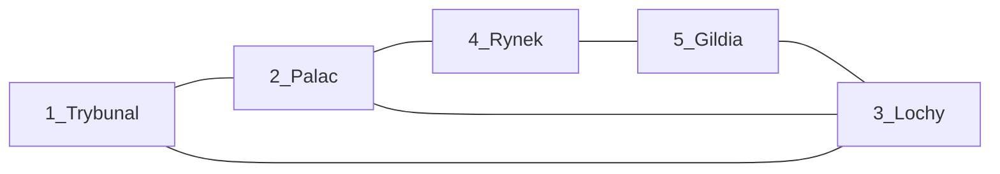

[Strona główna](../../README.md) > [Gra](../README.md) > [Plansza](README.md)

---

# Plansza — Instytucje Władzy

Mapa **instytucjonalna** (schemat mechaniki), nie geografia Toledo.  
Dokładny wygląd miasta = warstwa artysty później; tu liczy się **graf ruchu + sloty**.

Każda lokacja ma **Mechanikę Podwójnego Dna**: stronę Jawną (**Światło**) i Ukrytą (**Cień**).

Akcje Cienia wymagają Agenta w lokacji i zwykle podnoszą Poziom Herezji lub ryzykują odkrycie.  
Figurka **Wielkiego Inkwizytora** stoi w jednej lokacji (Patrol / Autodafé).

| # | Lokacja | Światło (jawne) | Cień (ukryte) |
| :---: | :--- | :--- | :--- |
| 1 | **Trybunał Inkwizycji** | Czystość wiary, poparcie Kościoła | Procesy, konfiskaty, wymuszanie zeznań |
| 2 | **Pałac Gubernatora** | Podatki, dekrety miejskie | Przekupstwo, fałszerstwa akt, zmiana prawa |
| 3 | **Lochy & Podziemia** | Nadzór, publiczne przesłuchania | Areszt, Podwójni, tajne egzekucje |
| 4 | **Rynek i Plac Publiczny** | Handel, najemnicy, nastroje ludu | Zamieszki, herezja publiczna, samosądy |
| 5 | **Dzielnica Smogów / Gildia** | Unikalne dobra, informatorzy | Skrytobójstwa, szantaż, handel Relikwiami |

## Kolejność rozpatrywania (Faza III)

Lokacje odkrywane i rozpatrywane **od 1 do 5**.  
To **nie** jest graf ruchu — tylko kolejność odkrywania kart.

## Inkwizytor

- Start: **Trybunał**, stan Patrol.
- Faza I: nasłania → ruch **0–1 wzdłuż krawędzi grafu** → opcjonalne Autodafé.
- Autodafé: +1 Herezja właścicielom Agentów w lokacji; +1 Stos; Relikwia → pula.
- Nasłanie / edykt „w stronę X”: jeden krok po **najkrótszej ścieżce** w grafie.

## Relikwie i szlaki

- Relikwie transportowane między lokacjami (karty / zasady).
- Talia Czasu może otwierać krypty lub **Szlak Morski** (ewakuacja poza planszę).

## Sąsiedztwo (ruch o 1 lokację = 1 krawędź)

Cykl 5 + cięciwa **Lochy–Pałac** (lochy pod władzą):

| Lokacja | Sąsiedzi |
| :--- | :--- |
| Trybunał | Pałac, Lochy |
| Pałac | Trybunał, Rynek, **Lochy** |
| Lochy | Trybunał, Pałac, Gildia |
| Rynek | Pałac, Gildia |
| Gildia | Rynek, Lochy |



Każdy węzeł ma stopień ≥2 → ruch o 1 ma **wybór** (blof). Dwie ścieżki Trybunał↔Rynek. Karty / karta specjalna mogą łamać sąsiedztwo.

---

## Szkic layoutu do wydruku (szablon mechaniki)

Wydrukuj na **A2 portrait** (`420×594 mm`) — odpowiada siatce **2×2 A4** (linie cięcia na PnP).  
Diagram gry, nie mapa miasta. W każdym węźle: **stos ≤3 kart** 63×88 mm (jeden slot).

**Skala fizyczna (PnP):**
- Baza Agenta: **Ø 20 mm** (okrągła)
- Areszt (Lochy): **Ø 20 mm** (okrągłe — na Agentów)
- Żetony (Relikwia, Stos, Fragment, Hak, Złoto, Herezja, …) + pule: **20×20 mm**, lekko zaokrąglone rogi
- Karty w lokacji: **stos ≤3** na slocie **63×88 mm**
- **Talia Czasu:** karty edyktów (talia + aktywny Edykt Ery) — nie żetony

```
  [Relikwie · Stosy · Fragmenty]     [Talia Czasu: talia | edykt]
                    ● Inkwizytor (na lokacji)

                      (2) PAŁAC
                     ╱    │    ╲
                    ╱     │     ╲
        (1) TRYBUNAŁ      │      (4) RYNEK
              │  ╲        │        │
              │   ╲───────┘        │
              │                    │
        (3) LOCHY ────────── (5) GILDIA

  W każdym węźle: ○○○○ Agenci · Relikwia □ · ▭ stos ≤3
  Lochy +: Areszt ○○○○
  Faza III: odkrywaj 1 → 2 → 3 → 4 → 5 (niezależnie od ulic)
```

### Legenda slotów

| Element | Co kłaść |
| :--- | :--- |
| Agenci ○ | Pionki frakcji (+ nakładka Podwójny jeśli aktywna) |
| Relikwia [ ] | Żeton Relikwii w lokacji |
| Karty zakryte ▭ | Zagrane w Fazie II, odkrywane w Fazie III |
| Areszt ○ (Lochy) | Agenci uwięzieni przed Przesłuchaniem |
| Inkwizytor ● | Figurka NPC + stan Patrol/Autodafé (stoi **w** lokacji) |
| Ulice | Tylko krawędzie grafu — legalny ruch o 1 |
| Szlak Morski | Oznaczany edyktem (np. Flota Kolumba) |
| Haki | Przy planszetkach graczy, nie na lokacjach |

### Playtest

Czy ulice (krawędzie) są czytelne ze stołu? Czy Lochy + Areszt nie giną? Czy dwa wyjścia z węzła dają realny blof ruchu?
