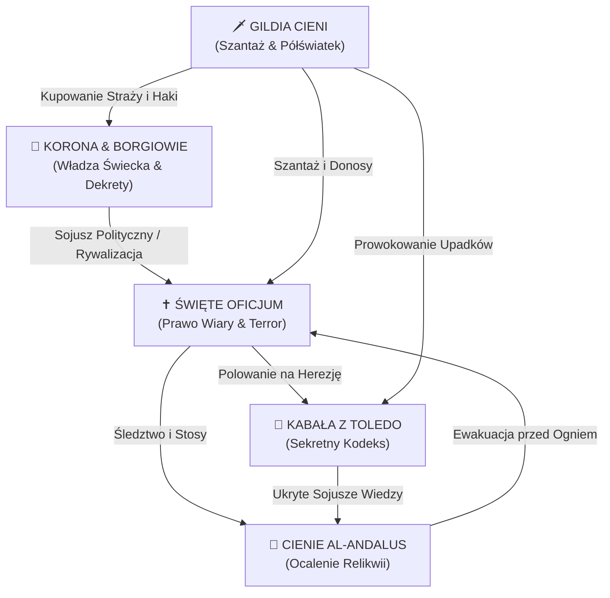

# Frakcje — Toledo, Rok Pański 1492

*Miasto Trzech Kultur w cieniu stosów i królewskich edyktów.*

Rok **1492** to jeden z najbardziej dramatycznych punktów zwrotnych w historii świata. W Hiszpanii ścierają się potężne siły:
1. **Styczeń:** Upada Emirat Grenady — kończy się 800 lat obecności muzułmańskiej w Al-Andalus.
2. **Marzec:** Królowie Katoliccy podpisują *Edykt z Alhambry* nakazujący wygnanie Żydów sefardyjskich.
3. **Sierpień:** Kardynał Rodrigo Borgia zostaje papieżem Aleksandrem VI, a Krzysztof Kolumb wyrusza ku Nowemu Światu.
4. **Przez cały rok:** Wielki Inkwizytor Tomás de Torquemada rozbudowuje aparat terroru Świętego Oficjum.

W sercu Kastylii — wielokulturowym **Toledo** — pięć potęg toczy bezwzględną, ukrytą wojnę o przetrwanie, władzę, wiarę i wiedzę.

---

## 🎭 Przegląd 5 Frakcji

| Frakcja | Archetyp Historyczny | Styl Gry | Główny Cel Zwycięstwa |
| :--- | :--- | :--- | :--- |
| [**Święte Oficjum**](swiete-oficjum.md) | Inkwizycja Torquemady, familiariusze | Terror, Autodafé, oskarżenia | **4 Stosy** lub **3 Skazania** |
| [**Cienie Al-Andalus**](cienie-al-andalus.md) | Moryskowie, ostatni Maurowie | Kamuflaż (*takijja*), tunele, relikwie | **2 Relikwie** + Szlak Morski |
| [**Korona & Borgiowie**](korona-borgiowie.md) | Królowie Katoliccy, Kuria Borgiów | Prawo stołu, dekrety, wielkie złoto | **2 Dekrety** od Ery 5 |
| [**Kabała z Toledo**](kabala-toledo.md) | Sefardyjscy uczeni, alchemicy, *Zohar* | Sweet-spot Herezji `[3, 8]`, Kodeks | **3 Fragmenty** w Paśmie Herezji |
| [**Gildia Cieni**](gildia-cieni.md) | Półświatek kastylijski (*hampa*), szantaż | Donosy, fałszywi świadkowie, Haki | **4 Upadki** |

---

## ⚔️ Sieć Napięć i Konfliktów

---

## 📜 Szczegółowe Przewodniki po Frakcjach:
- [✝️ Święte Oficjum — Zasady, Lore i Talia](swiete-oficjum.md)
- [🌙 Cienie Al-Andalus — Zasady, Lore i Talia](cienie-al-andalus.md)
- [👑 Korona & Borgiowie — Zasady, Lore i Talia](korona-borgiowie.md)
- [📜 Kabała z Toledo — Zasady, Lore i Talia](kabala-toledo.md)
- [🗡️ Gildia Cieni — Zasady, Lore i Talia](gildia-cieni.md)
